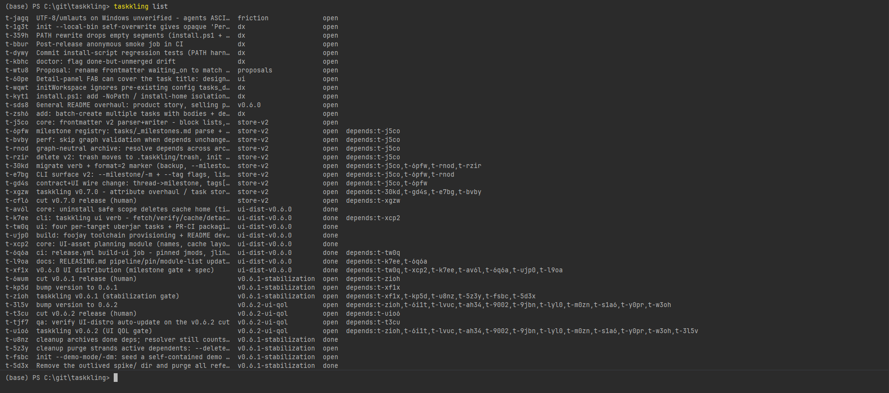
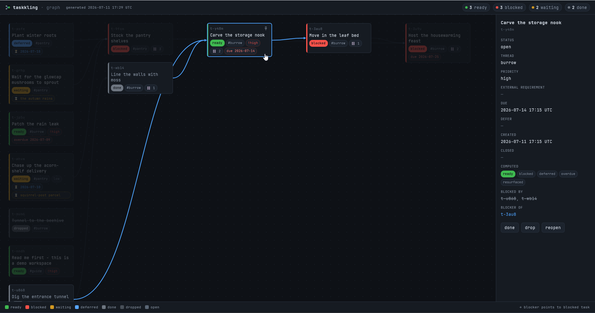

<p align="center">
  
</p>

# taskkling

A **fully local task manager** representing your **tasks as markdown files, with N-to-M dependencies between them**.

It's meant for single individuals organizing work that is too complex for a todo list, yet too minute for a ticket system.

 <WIP replace with demo taskkling list>

Once installed, you can open a terminal, `cd` into your directory of choice (project folder, your user dir, a git repo, etc.)
and run `taskkling init` to create a directory-bound taskkling store. 
In that directory, you can use **simple CLI commands** to interact with your tasks, like `taskkling list`, or **use the UI** via `taskkling ui`.



It stays **completely local on your machine** (no database, server, or background process), and allows you to **organize tasks in a direct acyclical graph (DAG)**, 
as well as keeping track of light-weight metadata, like adding a datetime until which the task is considered `deferred`. 

As you might have guessed... it is also developed for (and with) **AI agents**, to provide a shared surface for tasks to do yourself, or handoff to your artificial assistants :)

> If you want to run the demo to get a feel for the tool, follow the [Installation](#Installation) and run `taskkling init --demo-mode` in an empty folder. (WIP)

## Why use taskkling ?

Taskkling is aimed to sit between existing task management tools, bringing together the upsides of each:
* Text editors (e.g. Notepad)
  * (+) Simple todo lists
  * (-) Can't handle complexity beyond `- []`
* Obsidian vault
  * (+) Graph-based structure
  * (-) Hard to understand task state
* Ticket systems (e.g. Jira)
  * (+) Capture vast possible
  * (-) Requires enterprise-grade setup and maintenance
* [Taskwarrior](https://taskwarrior.org/)
  * (+) Light-weight local task manager
  * (-) Poor ergonomics, no UI

A major benefit to this tool is providing a delightful UI experience, while giving agents a low-friction task surface.

I hope you come to like it.

### Tool Comparison

| | Text editors | Obsidian | Ticket systems  | Taskwarrior | **taskkling** |
|---|:-:|:--------:|:-:|:-:|:-:|
| Binary tasks (`[ ]`/`[x]`)? | ✅ |    ✅     | ✅ | ✅ | ✅ |
| Task states beyond open/done? | ❌ |    ~     | ✅ | ✅ | ✅ |
| Custom states & workflows? | ❌ |    ~     | ✅ | ❌ | ❌ |
| Tags, priority, due dates? | ❌ |    ~     | ✅ | ✅ | ✅ |
| N-to-M task dependencies? | ❌ |    ❌     | ✅ | ✅ | ✅ |
| Allows sub-tasking? | ❌ |    ❌     | ✅ | ❌ | ❌ |
| "What's ready right now?" out of the box? | ❌ |    ❌     | ~ | ✅ | ✅ |
| Tasks are human-editable text files? | ✅ |    ✅     | ❌ | ~ | ✅ |
| Has a GUI? | ✅ |    ✅     | ✅ | ❌ | ✅ |
| Works without internet? | ✅ |    ✅     | ❌ | ✅ | ✅* |
| No server, account, or admin? | ✅ |    ✅     | ❌ | ✅ | ✅ |
| Multi-user collaboration? | ❌ |    ~     | ✅ | ❌ | ❌ |

✅ yes · ~ partial / needs plugins or setup · ❌ no · \* the CLI is fully offline; the first `taskkling ui` run downloads the UI once, then it's cached.

Neither the tools nor the capabilities are exhaustive — open an issue or PR to suggest extensions.

## Installation

**macOS / Linux**

```sh
curl -fsSL https://github.com/Treide1/taskkling/releases/latest/download/install.sh | sh
```

**Windows (PowerShell)**

```powershell
irm https://github.com/Treide1/taskkling/releases/latest/download/install.ps1 | iex
```

Both scripts fetch the `taskkling` binary for your platform and put it on `PATH`:
`~/.local/bin` on Unix, `%LOCALAPPDATA%\Programs\taskkling` on Windows. 

Restart your shell (or open a new terminal) so the new location is picked up.
Verify with: 
```
taskkling --version
```

### Manual install (for nerds)

Download the binary for your platform from the [Releases page](../../releases) and place
it somewhere on your `PATH`. Verify it against the accompanying `SHA256SUMS` file:

```sh
# Unix
sha256sum -c SHA256SUMS

# macOS (shasum ships by default)
shasum -a 256 -c SHA256SUMS
```

On **Windows (PowerShell)**, compare the binary's hash against its `SHA256SUMS` line
(`-eq` is case-insensitive, so the upper-case `Get-FileHash` digest still matches):

```powershell
$want = (((Get-Content SHA256SUMS | Select-String 'taskkling-windows-x64.exe') -split '\s+')[0])
$got  = (Get-FileHash -Algorithm SHA256 .\taskkling-windows-x64.exe).Hash
if ($got -eq $want) { 'OK' } else { 'MISMATCH' }
```

**macOS quarantine caveat:** a binary downloaded via a browser carries the quarantine
attribute and will be blocked by Gatekeeper on first run. Clear it with:

```sh
xattr -dr com.apple.quarantine ./taskkling
```

This is not needed when using the `curl | sh` path above — `curl` does not set the
quarantine attribute.

## Initializing a taskkling store

There are two ways to drive `taskkling` after install:

**1. Global PATH (recommended)**
In your workspace(s), run `taskkling init`. Afterwards, you can use `taskkling …` from anywhere inside a project tree (not just root). 
This will use the global binary, but walk up the directory tree until it finds a parent dir, which contains `.taskkling/`.

**2. Per-project wrapper scripts**
In your workspace(s), run `taskkling init --local-bin`. 
This scaffolds the workspace AND copies the running binary into `.taskkling/bin`, then drops
the wrapper scripts (`./taskkling` + `./taskkling.cmd`) in the repo root. Run this once
after a fresh install to set up the per-project wrapper in one step.

> **Note:** This installation type requires you to use a `--global` or `--local` flag, when updating or uninstalling the respective binary !
> Updates and/or uninstalls will only affect the invoked binary, and will not propagate from local to global, or vice versa !

## Usage

After install, you can use `taskkling --help` to see all commands.

```sh
taskkling add "Draft the proposal" -t docs        # create a task, prints its id (-b - = body from stdin)
taskkling add "Ship it" -t docs -d t-a1z9         # depends on t-a1z9 (-d repeats; or -d a,b)
taskkling list                                    # whole backlog, ls -la style
taskkling list --ready                            # what's actionable right now
taskkling export                                  # full JSON (stored + computed)

taskkling done <id>                               # lifecycle: done / drop / reopen / wait
taskkling set <id> --due 2026-07-31 --priority high
taskkling write <id> "body text"                  # body I/O: write / append / read (- = stdin)
taskkling link <id> --depends <dep>               # edges: link / unlink (cycle-checked)
taskkling delete <id>                             # -> trash, prunes dependents; restore <id> undoes
taskkling cleanup                                 # sweep closed tasks -> archive/
```

Full command surface in [PRD.md §10](PRD.md).

## Updating

`taskkling update` updates the invoked (!) binary in-place.

> Should you invoke this from a local binary, you have to use a `--global` or `--local` to distinguish.

```sh
taskkling update                   # update to the latest release 
taskkling update --check           # report only: is a newer release out?
taskkling update --version v0.3.0  # install a specific release tag
```

When in doubt, rerun [Installation](#Installation) to override the global install in-place.

## Uninstalling

`taskkling uninstall` removes the binary and the `PATH` entry.
Your workspace — `.taskkling/` (config, caches) and your tasks directory — is never touched unless you explicitly pass `--purge`.

> Should you invoke this from a local binary, you have to use a `--global` or `--local` to distinguish.

```sh
taskkling uninstall          # interactive: shows what it will remove, then asks
taskkling uninstall --purge  # ALSO delete .taskkling/ AND the tasks dir — irreversible
taskkling uninstall -y       # just do it...
```

## Technical details (for nerds, too)

### Tech stack

We use GitHub workflows, to perform CI and manage releases. Each of which contains:

- Install scripts (`install.ps1`, `install.sh`)
- Installation executables for the CLI for all supported platforms (macOS (Silicon/Intel), Linux, Windows)
- Installation executables for the jdk-bundled UI for all supported platforms

The CLI tool is a **Kotlin/Native CLI** (`taskkling`) binary.
It's the only I/O operator of the taskkling store. 

The UI is a **Compose Desktop application**. 
It's a pure CLI client, and renders the CLI's JSON `export`. Every mutation it performs, triggers a re-export.

Once the CLI is installed, the first `taskkling ui` run triggers a UI download (~80-100MB) to cache. 

### Development

Any JDK findable on `PATH` or `JAVA_HOME` boots Gradle; the build then
auto-provisions the JDK 21 it actually compiles with (foojay toolchain
resolver) — no manual Temurin install, no `JAVA_HOME` ritual.

```sh
./gradlew :cli:linkDebugExecutableMingwX64    # native CLI (host target: Mingw/Linux/Macos)
./gradlew :cli:linkReleaseExecutableMingwX64  # optimized release binary
./gradlew :contract:jvmTest :core:jvmTest     # fast JVM unit/golden tests
./gradlew :ui:run                             # launch the Compose Desktop UI from source
./gradlew :ui:createDistributable             # assemble the packaged app image
```

The debug CLI lands at `cli/build/bin/<target>/debugExecutable/taskkling[.exe]`
(`<target>` = `mingwX64` on Windows, `linuxX64` / `macosArm64` elsewhere).

### Modules

| Module | Targets | Responsibility |
|---|---|---|
| `:contract` | native + JVM | `@Serializable` DTOs for the `export` JSON contract (CLI ↔ UI) |
| `:core` | native + JVM | domain model, frontmatter I/O, graph + ready-set + validation, lock/atomic-write |
| `:cli` | native | the `taskkling` binary; thin command layer over `:core` |
| `:ui` | JVM (Compose Desktop) | desktop app; renders `export`, mutates via the CLI |

The UI links **only `:contract`** (the DTOs), never `:core` — so it is *physically
incapable* of writing task files, structurally guaranteeing the single-write-path design.

### This repo dogfoods itself

taskkling's own development backlog is tracked **in taskkling**.

For development convenience, it is gitignored to not conflate mocked taskkling stores with the live one.
So you have to... trust me, bro `¯\(͡°͜ʖ͡°)/¯`.

## License

See repository for license details.
